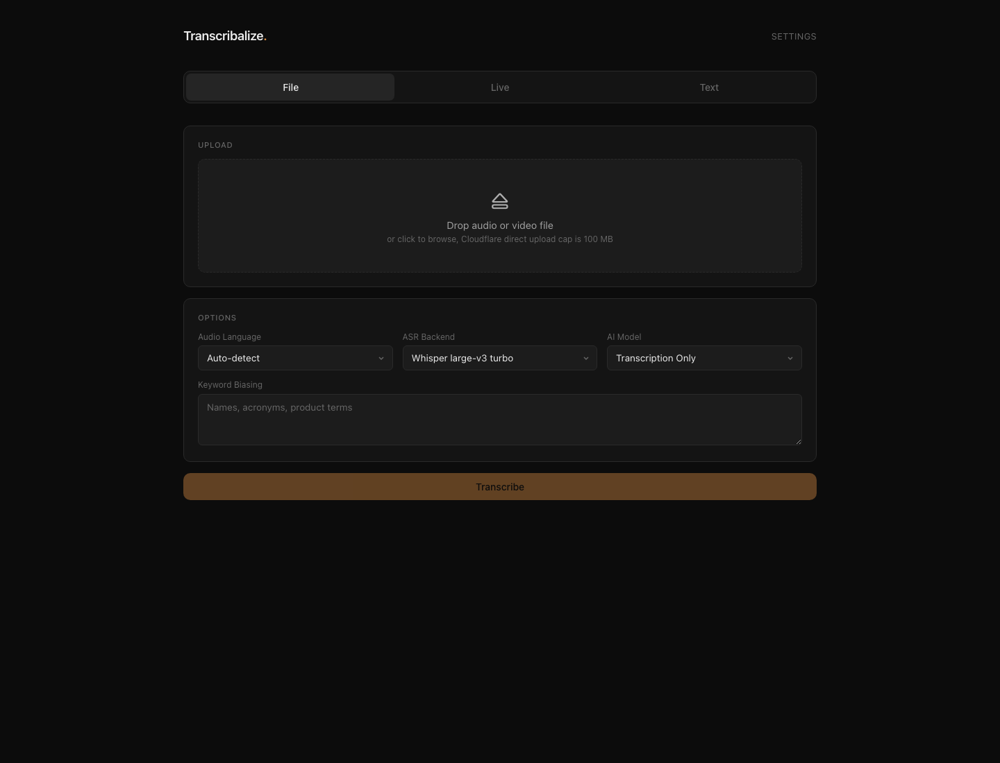
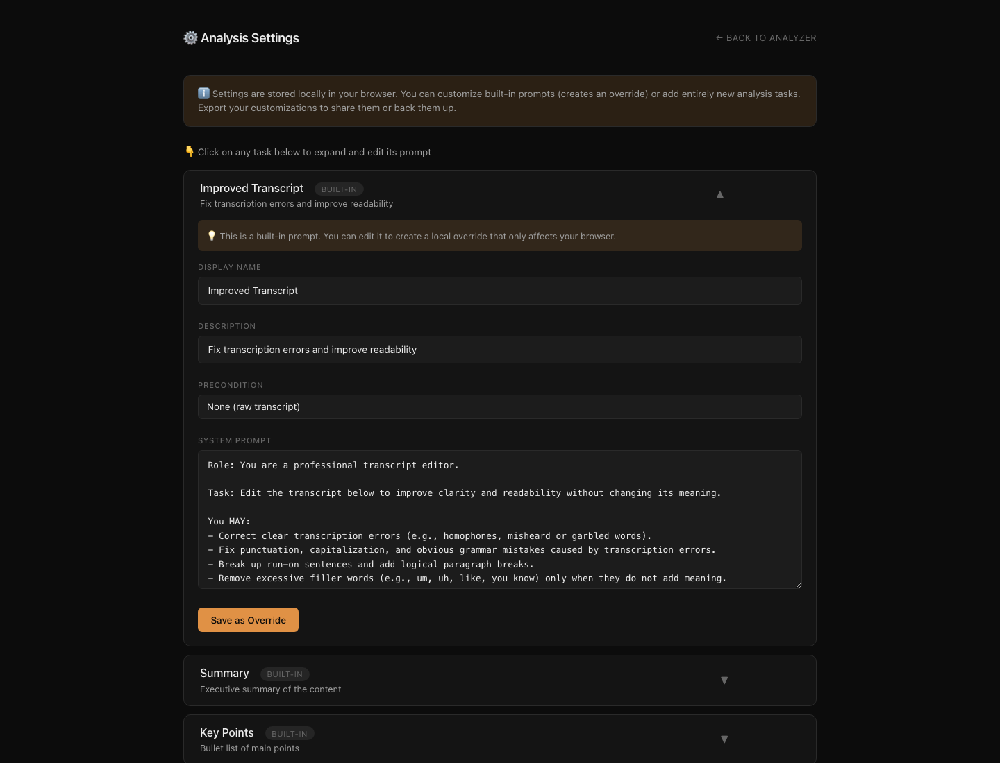

# Transcribalize

> Transcribe, analyze, and understand audio.

[](https://github.com/tech-grandpa/transcribalize/actions/workflows/ci.yml)
[](LICENSE)

Transcribalize is a self-hosted application for turning audio, video, or existing transcript text into useful written output. It combines local GPU transcription, a browser interface, REST and streaming APIs, live browser capture, and optional LLM analysis in one FastAPI service.

## Screenshots

### Transcription workspace



### Analysis settings



## What you can do

| Workflow | Input | Result |
|---|---|---|
| File transcription | Audio or video upload | Plain text, Markdown, SRT, or JSON |
| File analysis | Audio or video upload | Transcript plus selected analysis tasks |
| Live transcription | Microphone, browser-tab audio, or both | A live transcript that can be copied, downloaded, or sent to analysis |
| Transcript analysis | Pasted transcript text | Improved transcript, summary, key points, documentation, or action items |
| API integration | Files, text, chunks, or PCM audio | REST, Server-Sent Events, or WebSocket responses |

File transcription runs locally on the host. LLM analysis is optional; when enabled, it sends transcript text to the provider you configure.

## Before you start

The supported Docker path requires:

- a Linux host with an NVIDIA GPU
- a CUDA-capable NVIDIA driver
- Docker with Compose
- NVIDIA Container Toolkit
- enough disk space for the container image and selected model caches
- outbound network access while building the image and downloading model artifacts

The default Whisper implementation uses CUDA with `float16`; it does not fall back to CPU. Granite and Parakeet can select CPU in their Python integrations, but the supplied Compose deployment is built and tested as an NVIDIA GPU service.

Transcribalize has no built-in login or API authentication. Do not expose it directly to the internet. Put public deployments behind TLS, authentication, rate limits, and reverse-proxy request limits.

## Quick start

Transcription works without an LLM API key. Pull and run the published GPU image; no repository clone is required:

```bash
docker run -d \
  --name transcribalize \
  --restart unless-stopped \
  --gpus all \
  -p 8000:8000 \
  -v transcribalize-models:/models \
  ghcr.io/tech-grandpa/transcribalize:0.1.0
```

The image is published for `linux/amd64` and includes the default Whisper model plus the optional Parakeet and Granite runtime dependencies. The named volume preserves downloaded model data across container replacements. Add `--env-file /path/to/transcribalize.env` before the image name to enable optional LLM analysis with your own provider configuration.

Published release tags include `0.1.0`, the rolling `0.1` and `0` aliases, and `latest`. Production deployments should prefer the full version tag or the immutable digest shown by the package registry.

When the service is ready, open:

- `http://localhost:8000` for the browser application
- `http://localhost:8000/docs` for interactive OpenAPI documentation
- `http://localhost:8000/health` for a health check

```bash
curl -fsS http://localhost:8000/health
```

Expected response:

```json
{"status":"ok"}
```

Stop and remove the container with:

```bash
docker rm -f transcribalize
```

### Build from source

To build the current source instead of using the published image:

```bash
git clone https://github.com/tech-grandpa/transcribalize.git
cd transcribalize
docker compose -f transcriber/docker-compose.yml up --build
```

Stop the source-built Compose service with:

```bash
docker compose -f transcriber/docker-compose.yml down
```

## Use the browser application

The main page has three modes.

### File

Drop an audio or video file, choose an ASR backend and language, then transcribe it. If you configure an LLM provider, you can select analysis tasks and an output language in the same workflow.

The browser uses direct upload for files up to 95 MiB. Larger files are split into 8 MiB chunks and assembled by the service before processing. This is especially useful when Transcribalize is behind an edge firewall or reverse proxy such as Cloudflare: each request stays below the proxy's per-request upload-size limit, so the complete file can be larger than that limit. Proxy timeouts, rate limits, and any deployment-wide storage quotas still apply.

### Live

Capture microphone audio, browser-tab audio, or both. The browser sends 16 kHz mono PCM audio to the same host over WebSocket, and the server transcribes speech with Whisper and voice activity detection. The completed transcript can be copied, downloaded as Markdown, or sent directly into the analysis workflow.

Chrome or Firefox provides the best tab-audio capture support. Safari has limited support. Outside `localhost`, browser capture should be served over HTTPS/WSS. The default server limit is four concurrent live sessions.

### Text

Paste an existing transcript and run analysis without uploading media or invoking an ASR model.

Analysis results are rendered as sanitized Markdown. You can copy the current result or download the transcript and completed built-in task results as one Markdown file. Custom-task results can be copied individually; the combined download currently includes built-in task IDs only. Browser preferences, custom prompts, and live-session recovery data are stored in browser local storage.

## File transcription backends

Discover the running service's backend metadata at `GET /asr/providers`.

| Backend ID | Model | File transcription | Live | Keyword hints | Notes |
|---|---|---:|---:|---:|---|
| `whisper` | faster-whisper large-v3-turbo | Yes | Yes | Yes | Default backend; supports incremental segment progress |
| `parakeet-tdt-0.6b-v3` | NVIDIA Parakeet TDT 0.6B v3 | Yes | No | No | Experimental multilingual backend; processes files in configurable chunks |
| `granite-2b` | IBM Granite Speech 4.1 2B | Yes | No | Yes | Experimental; returns file results after model generation |
| `granite-2b-plus` | IBM Granite Speech 4.1 2B Plus | Yes | No | Yes | Experimental; currently exposed as plain file transcription |

The supplied Compose configuration installs the optional Transformers dependencies used by Parakeet and Granite. Their model weights are downloaded when first selected and cached in the same persistent model volume.

File-transcription endpoints accept `auto`, `en`, and `de` as language values. Whisper uses the selection; the current Granite and Parakeet integrations do not force recognition language. Keyword hints can be separated by commas or newlines. Whisper receives them as hotwords, Granite receives them as prompt keywords, and Parakeet ignores them.

### Supported media

Audio: `.mp3`, `.wav`, `.flac`, `.ogg`, `.m4a`, `.aac`, `.wma`, `.opus`, `.webm`

Video: `.mp4`, `.mkv`, `.avi`, `.mov`, `.wmv`, `.flv`, `.mpeg`, `.mpg`, `.ts`, `.webm`

FFmpeg converts accepted input to 16 kHz mono WAV before transcription. Acceptance is based on the filename extension; the submitted MIME type is not used to validate the media format.

## Optional transcript analysis

Copy the example configuration before starting the container:

```bash
cp .env.example .env
```

The provided example is configured for an OpenAI-compatible OpenRouter endpoint:

```env
OPENAI_API_KEY=your_api_key_here
OPENAI_BASE_URL=https://openrouter.ai/api/v1
DEFAULT_MODEL=anthropic/claude-opus-4.8
ASR_BACKEND=whisper
```

Restart the service after changing `.env`:

```bash
docker compose -f transcriber/docker-compose.yml up -d --build
```

Explicit model selections must use an ID listed by `GET /models`; the allowlist is defined in [`transcriber/app/llm.py`](transcriber/app/llm.py). If `DEFAULT_MODEL` is overridden, keep it in that allowlist because an omitted model selection uses the configured default. Provider use may incur cost and is governed by that provider's data-retention and usage policies.

### Built-in analysis tasks

| Task | Output | Default input dependency |
|---|---|---|
| Improved Transcript | Corrected and formatted transcript | Raw transcript |
| Summary | Short executive summary | Improved Transcript |
| Key Points | Main points as bullets | Improved Transcript |
| Concepts & Documentation | Structured reference notes | Improved Transcript |
| Action Items & Tasks | Tasks, owners, deadlines, and context | Improved Transcript |

In the streaming workflow, dependencies are included automatically. The settings page lets you edit built-in prompts, add custom tasks, set task dependencies, and import or export custom prompt definitions. Those changes stay in the current browser unless you export them.

## API

The full reference is in [`transcriber/docs/API.md`](transcriber/docs/API.md). A running instance also serves Swagger UI at `/docs` and ReDoc at `/redoc`.

### Transcribe a file

```bash
curl -X POST http://localhost:8000/transcribe \
  -F "file=@meeting.mp3" \
  -F "language=auto" \
  -F "asr_backend=whisper" \
  -F "keyword_bias=Acme, Project Atlas" \
  -F "format=srt"
```

Supported output formats are `json`, `text`, `srt`, and `markdown`.

### Stream transcription progress

```bash
curl -N -X POST http://localhost:8000/transcribe/stream \
  -F "file=@meeting.mp3" \
  -F "language=auto" \
  -F "format=markdown"
```

### Analyze existing text

```bash
curl -N -X POST http://localhost:8000/analyze/stream \
  -F "transcript_text=Paste transcript text here" \
  -F "model=anthropic/claude-opus-4.8" \
  -F "tasks=summary" \
  -F "tasks=keypoints"
```

Analysis SSE reports workflow and completed-task events; it does not stream individual LLM tokens.

### Large-file uploads

Direct API uploads are capped at 95 MiB. Clients can inspect the active limits at `GET /upload/config`. The browser switches to this chunked flow automatically for larger files:

1. `POST /upload/init`
2. `POST /upload/chunk` for each 8 MiB chunk
3. `POST /upload/complete`
4. `POST /analyze/stream` with the returned `upload_id`

Completed upload sessions are removed after the streaming analysis/transcription workflow consumes them. Reverse proxies may impose stricter request or timeout limits, so configure them separately.

Only `/analyze/stream` accepts an assembled `upload_id`. The current chunked-upload protocol limits each part but does not enforce a total session-size ceiling or checksum. Abandoned or failed sessions have no automatic expiry and may remain in temporary storage, so network-accessible deployments should add proxy quotas and operational cleanup.

## Configuration

The repository-root [`.env.example`](.env.example) contains safe placeholders. Docker Compose passes that file into the service when a local `.env` exists.

| Variable | Default | Purpose |
|---|---|---|
| `OPENAI_API_KEY` | unset | Credential for optional LLM analysis |
| `OPENAI_BASE_URL` | unset | OpenAI-compatible API endpoint; the example uses OpenRouter |
| `DEFAULT_MODEL` | `anthropic/claude-opus-4.8` | Model used when a request omits an explicit selection; keep it in the code-defined allowlist |
| `ASR_BACKEND` | `whisper` | Default file-transcription backend |
| `GRANITE_MAX_NEW_TOKENS` | `2000` | Granite generation limit |
| `GRANITE_TORCH_DTYPE` | `bfloat16` | Granite model dtype |
| `PARAKEET_TORCH_DTYPE` | `bfloat16` | Parakeet model dtype |
| `PARAKEET_CHUNK_SECONDS` | `60` | Parakeet file chunk duration |
| `PARAKEET_CHUNK_OVERLAP_SECONDS` | `0` | Parakeet overlap between file chunks |
| `MAX_CONCURRENT_SESSIONS` | `4` | Live WebSocket session limit |

Keep `.env` files, credentials, recordings, and transcripts out of Git. The repository ignore rules cover nested environment files and common generated artifacts.

## How it works

```text
Browser UI or API client
          |
          v
       FastAPI
   /       |        \
files   live PCM   transcript text
  |         |            |
FFmpeg   WebSocket        |
  |         |            |
  +---- ASR provider ----+
          |
      transcript
       /       \
      v         v
local outputs   optional external LLM provider
(text/Markdown/SRT/JSON)      |
                          analysis Markdown
```

The main components are:

- [`transcriber/app/main.py`](transcriber/app/main.py): routes, upload handling, workflow orchestration, and UI security headers
- [`transcriber/app/asr_providers.py`](transcriber/app/asr_providers.py): file-ASR registry and provider selection
- [`transcriber/app/transcriber.py`](transcriber/app/transcriber.py): faster-whisper integration
- [`transcriber/app/parakeet_transcriber.py`](transcriber/app/parakeet_transcriber.py): NVIDIA Parakeet file transcription
- [`transcriber/app/granite_transcriber.py`](transcriber/app/granite_transcriber.py): experimental Granite Speech integration
- [`transcriber/app/live_transcription.py`](transcriber/app/live_transcription.py): WebSocket sessions and VAD-based live chunking
- [`transcriber/app/llm.py`](transcriber/app/llm.py): optional LiteLLM analysis
- [`transcriber/static/`](transcriber/static/): browser application and vendored Markdown/sanitizer assets

## Security and privacy

- File and live transcription run locally on the Transcribalize host.
- LLM analysis sends transcript text to the configured provider.
- Direct uploads are capped at 95 MiB; larger browser uploads use individually bounded 8 MiB chunks, but total chunked-session size is not currently capped.
- Uploaded media is processed in temporary storage. Consumed chunked sessions are cleaned up, but abandoned or failed sessions have no automatic expiry.
- The browser UI ships its script dependencies locally and serves a restrictive Content Security Policy and related security headers.
- The service does not provide authentication, authorization, user isolation, or TLS.

Review [`SECURITY.md`](SECURITY.md) before an internet-facing deployment. Report vulnerabilities through GitHub's private vulnerability-reporting feature rather than a public issue.

## Development

The lightweight test environment does not require model downloads, a GPU, or real API credentials.

```bash
cd transcriber
python3.12 -m venv .venv
source .venv/bin/activate
python -m pip install --upgrade pip
python -m pip install -r requirements-test.txt ruff
pytest -q tests
ruff check .
python -m compileall -q app tests
docker compose config -q
```

The test suite covers API discovery, OpenAPI metadata, upload limits and chunk assembly, ASR selection, task dependencies, UI security headers, Markdown sanitization boundaries, and validation errors.

See [`CONTRIBUTING.md`](CONTRIBUTING.md) for contribution requirements and [`docs/DEPLOYMENT.md`](docs/DEPLOYMENT.md) for deployment workflow details.

## Project layout

```text
.
|-- .github/              CI, Dependabot, and opt-in deployment workflow
|-- docs/                 deployment, review, and design notes
|-- scripts/              environment-driven deploy and rollback helpers
|-- transcriber/
|   |-- app/              FastAPI service and transcription/analysis modules
|   |-- static/           browser UI and vendored browser dependencies
|   |-- tests/            API and security regression tests
|   |-- docs/API.md       API reference
|   |-- Dockerfile
|   `-- docker-compose.yml
|-- CONTRIBUTING.md
|-- SECURITY.md
`-- LICENSE
```

## Contributing

Issues and focused pull requests are welcome. Include regression tests for behavior changes and use only synthetic media or transcript fixtures. Do not commit credentials, private infrastructure details, production recordings, or real transcripts.

## License

The source code is licensed under the [Apache License 2.0](LICENSE). Downloaded ASR models, LLM services, and other external components have their own licenses and terms; review them before redistribution or commercial use.
